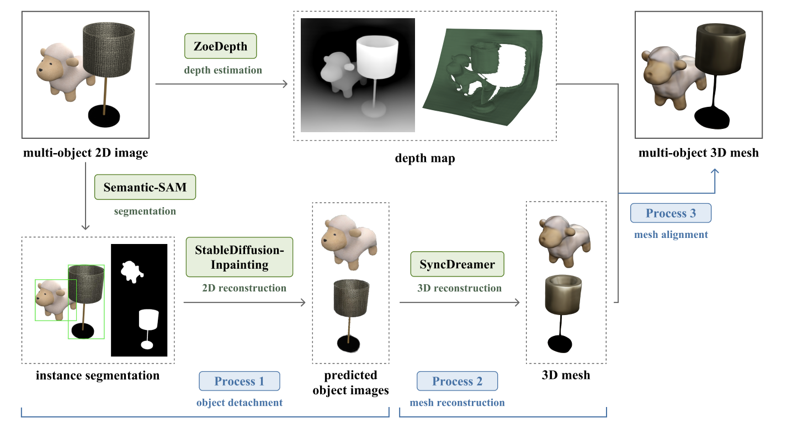
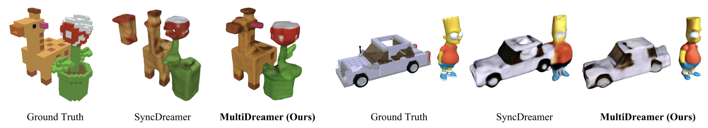
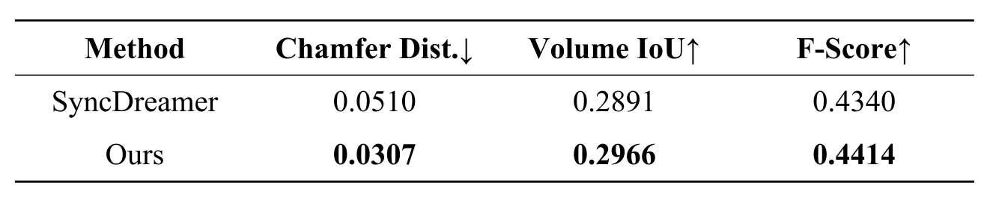

# MultiDreamer: Generating 3D mesh from a Single-view Multi-objects Image
Code release of our paper [MultiDreamer](https://google.com). Check out our [paper](https://google.com), and [website](https://multidreamer-demo.web.app)!


Model Architecture of MultiDreamer

## Development Environment
We use the following development environment for this project:
- Nvidia RTX 3090 GPU
- Intel Xeon Processor
- Ubuntu 22.04
- CUDA Version 11.7
- cudatoolkit 10.2.89, 11.7.1
- torch 1.10.1, 1.13.1
- torchvision 0.11.2
- Detectron2 0.6

## Installation
This code is developed using anaconda3 with Python 3.8 and 3.9 ([download here](https://repo.anaconda.com/archive/Anaconda3-2021.05-Linux-x86_64.sh)), therefore we recommend a similar setup.

You can simply run the following code in the command line to create the development environment:
```
$ source setup.sh
```


## Running the Demo


We provide two sample input images in `data/assets` folder. If you want to test for your own example, the images should consist of exactly two objects. To run the demo, you first need to download pre-trained model checkpoint file for two models, which are SemanticSAM and SyncDreamer, from this [Google Drive folder](https://drive.google.com/drive/folders/1uHwu3YmJnQm5I3HqxDYCuv_NbvvDndRX). The path of the downloaded files MUST follow below : 
```plaintext
MultiDreamer/models/
│
├─ SemanticSAM/
│  └─ models/
│     └─ swinl_only_sam_many2many.pth
│
└─ SyncDreamer/
   └─ ckpt/
      ├─ syncdreamer-pretrain.ckpt
      └─ ViT-L-14.pt
```

Before you run `demo.sh`, you shoud ckeck and modify the path of input image and output directory in `demo.sh`. If you need, make the `data/output/` directory :
```
INPUT_IMAGE="/MultiDreamer/data/assets/giraffe_and_flower/0_input_giraffe_and_flower.png"
OUTPUT_DIR="/MultiDreamer/data/output/giraffe_and_flower/"
```
and then, you can run :
```
$ bash demo.sh
```

## Preparing Data
### Downloading Processed Data (Recommended)
We provide 32 examples in this [Google Drive folder](https://drive.google.com/drive/folders/1uHwu3YmJnQm5I3HqxDYCuv_NbvvDndRX). In the link, each example folder contains `input png file` and `ground truth glb file`. We recommand you to set the downloaded folder as `data/eval/`.

## Evaluation
This is the qualitative presented in our paper.


In the evaluation part, we compared results of MultiDreamer(Ours) and SyncDreamer(Baseline). Then, we measured Chamfer Distance, Volume IoU, and F-Score for quantitative evaluation. The code to obtain results for both models and compute the metrics in `eval/eval.sh`. You can run : 
```
$ cd eval
$ bash eval.sh
```

Finally, you can get the result like the below table. The value of each metric can be difference from the table, since they are computed from randomly sampled vertices in the infered mesh and the ground truth mesh.




### Libraries
- https://pytorch.org/

- https://github.com/facebookresearch/detectron2

- https://github.com/facebookresearch/pytorch3d

- http://www.open3d.org/

### Projects
- https://github.com/liuyuan-pal/SyncDreamer

- https://github.com/UX-Decoder/Semantic-SAM

- https://huggingface.co/runwayml/stable-diffusion-inpainting

- https://github.com/isl-org/ZoeDepth
