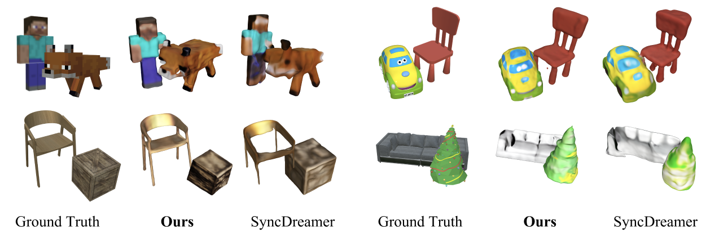

# MultiDreamer: Generating 3D mesh from a Single-view Multi-objects Image
Code release of our paper [MultiDreamer](https://google.com). Check out our [paper](https://google.com), and [website](https://multidreamer-demo.web.app)!


Model Architecture of MultiDreamer

## Development Environment
We use the following development environment for this project:
- Nvidia RTX 3090 GPU
- Intel Xeon Processor
- Ubuntu 22.04
- CUDA Version 11.7
- cudatoolkit 10.2.89, 11.7.1
- torch 1.10.1, 1.13.1
- torchvision 0.11.2
- Detectron2 0.6

## Installation
This code is developed using anaconda3 with Python 3.8 and 3.9 ([download here](https://repo.anaconda.com/archive/Anaconda3-2021.05-Linux-x86_64.sh)), therefore we recommend a similar setup.

You can simply run the following code in the command line to create the development environment:
```
$ source setup.sh
```


## Running the Demo


We provide two sample input images in `data/assets` folder. If you want to test for your own example, the images should consist of exactly two objects. To run the demo, you first need to download pre-trained model checkpoint file for two models, which are SemanticSAM and SyncDreamer, from this [Google Drive folder](https://drive.google.com/drive/folders/1uHwu3YmJnQm5I3HqxDYCuv_NbvvDndRX). The pathes of the downloaded files MUST follow below : 
```plaintext
MultiDreamer/models/
│
├─ SemanticSAM/
│  └─ models/
│     └─ swinl_only_sam_many2many.pth
│
└─ SyncDreamer/
   └─ ckpt/
      ├─ syncdreamer-pretrain.ckpt
      └─ ViT-L-14.pt
```

Before you run `demo.sh`, you shoud ckeck and modify the path of input image and output directory in `demo.sh`. If you need, make the `data/output/` directory :
```
INPUT_IMAGE="/MultiDreamer/data/assets/giraffe_and_flower/0_input_giraffe_and_flower.png"
OUTPUT_DIR="/MultiDreamer/data/output/giraffe_and_flower/"
```
and then, you can run :
```
$ bash demo.sh
```

## Preparing Data
### Downloading Processed Data (Recommended)
We provide 32 examples in this [Google Drive folder](https://drive.google.com/drive/folders/1uHwu3YmJnQm5I3HqxDYCuv_NbvvDndRX). In the link, each example folder contains `input png file` and `ground truth glb file`. 

## Evaluation
This is the qualitative and qunatitative result in our paper.



In our paper, the evaluation part, we compared results of MultiDreamer(Ours) and SyncDreamer(Baseline). The code to obtain results for SyncDreamer is embedded in eval.sh 

After you are done with `network/env.sh`, run the `run.sh` script to train a new model or evaluate an existing model based on the environment variables you set in `env.sh`:
```
$ cd network
$ sh run.sh
```

### Replicating Experiments from the Main Paper
Based on the configurations in `network/env.sh`, you can run different ablations from the paper. The default config will run the (final) experiment. You can do the following edits <b>cumulatively</b> for different experiments:

1. For P+E+W+R, set `RETRIEVAL_MODE=resnet_resnet+image`
2. For P+E+W, set `RETRIEVAL_MODE=nearest`
3. For P+E, set `NOC_WEIGHTS=0`
4. For P, set `E2E=0`

## Resources
To get the datasets and gain further insight regarding our implementation, we refer to the following datasets and open-source codebases:

### Datasets and Metadata
- https://shapenet.org/

- http://www.scan-net.org/

- https://github.com/skanti/Scan2CAD

### Libraries
- https://pytorch.org/

- https://github.com/facebookresearch/detectron2

- https://github.com/facebookresearch/pytorch3d

- http://www.open3d.org/

### Projects
- https://github.com/facebookresearch/meshrcnn

- https://github.com/xheon/JointEmbedding
